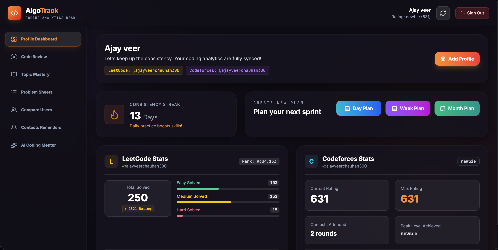
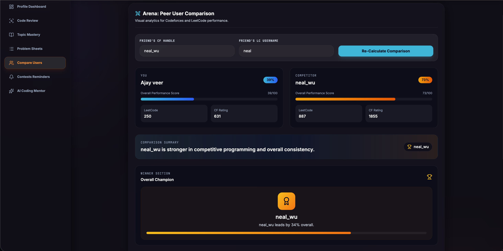
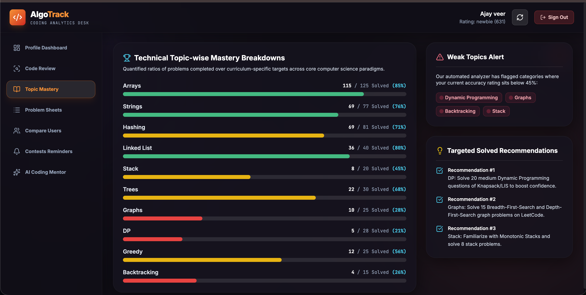
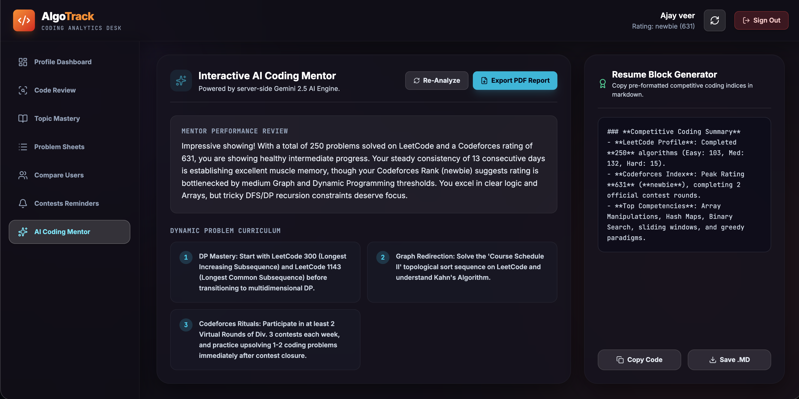
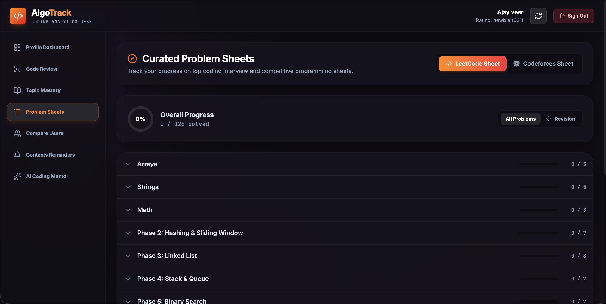
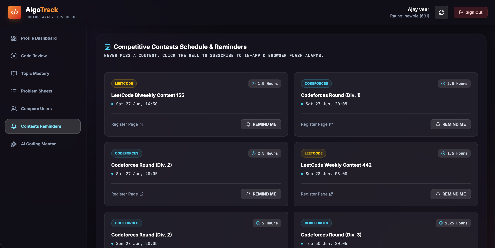
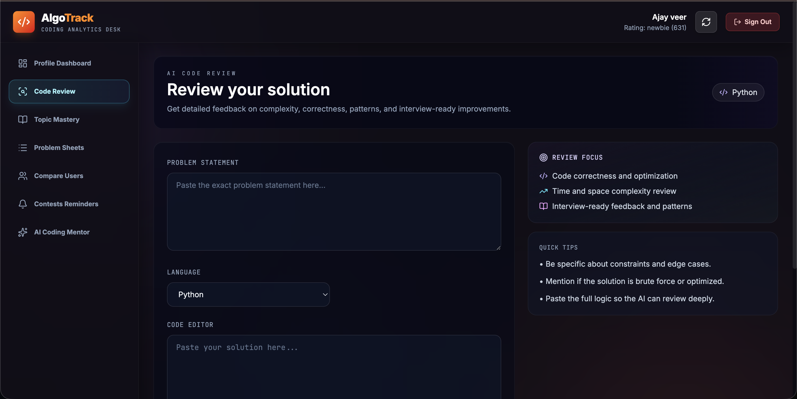

# AlgoTrack 🚀

AlgoTrack is a full-stack MERN application designed to help competitive programmers track, analyze, and improve their coding performance across platforms.

## ✨ Features

### 🔐 Authentication

* Secure JWT-based Login & Registration
* Protected Routes
* User Session Management

### 📊 Dashboard Analytics

* Coding Profile Overview
* Performance Metrics
* Problem Solving Statistics
* Contest Activity Tracking

### 📈 Topic Mastery Analysis

* Topic-wise Performance Breakdown
* Strength & Weakness Detection
* Improvement Suggestions

### ⚔️ User Comparison

* Compare Coding Profiles
* Side-by-Side Analytics
* Performance Insights

### 🤖 AI Coding Mentor

* Personalized Coding Guidance
* Improvement Recommendations
* Learning Roadmaps

### 📝 Problem Sheets

* Curated DSA Practice Problems
* Topic-wise Problem Collections

### 🔍 AI Code Review

* Analyze Code Quality
* Optimization Suggestions
* Best Practice Recommendations

### ⏰ Contest Reminders

* Upcoming Contest Tracking
* Coding Schedule Management

---

## 🛠 Tech Stack

### Frontend

* React.js
* Vite
* CSS

### Backend

* Node.js
* Express.js

### Database

* MongoDB Atlas

### Authentication

* JWT (JSON Web Tokens)

### AI Integration

* Google Gemini API

---

## 📂 Project Structure

```text
AlgoTrack/
│
├── frontend/
├── backend/
├── screenshots/
├── README.md
├── package.json
└── .gitignore
```

---

## 📸 Screenshots

### Dashboard


### User Comparison


### Topic Mastery Analysis


### AI Coding Mentor


### Problem Sheets


### Contest Reminder


### AI Code Review

---

